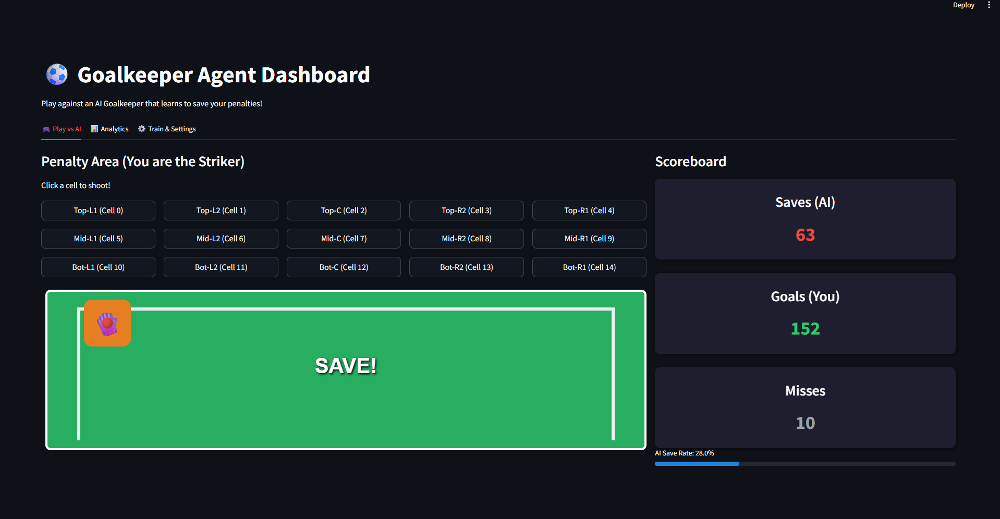
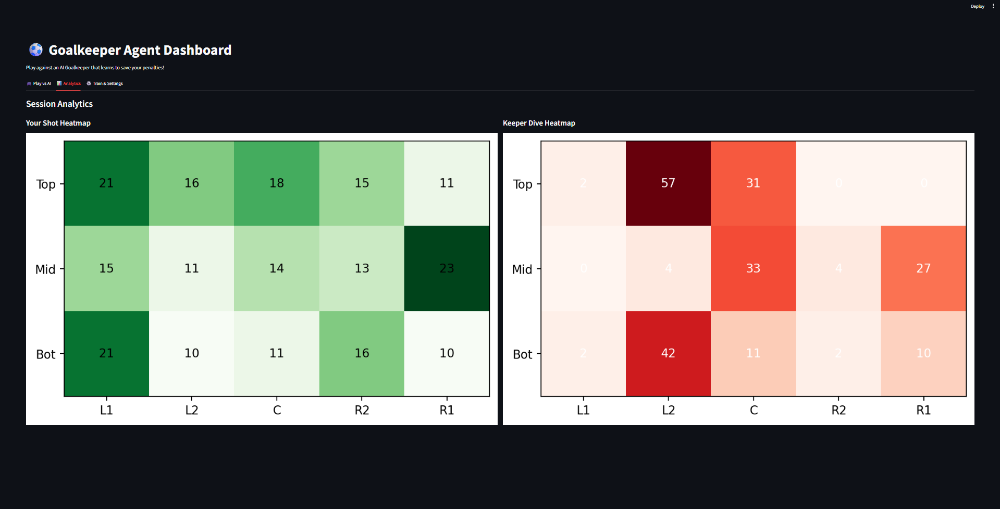

# AI-Goalkeeper 🧤⚽

An interactive reinforcement learning goalkeeper dashboard built with Streamlit. You can play against the Goalkeeper that learns to save your penalty shots using previous data.
## Features
### Interactive Gameplay
- **Play vs AI:** Take penalty shots on a 5x3 grid (slect a grid to shot.)
- Real-time AI predictions and saves
- Heat map of shot and keeper dives.
### AI-Powered Goalkeeper
- Trains using Q-Learning or Deep Q-Network (DQN)
- **Auto-Train:** Train the AI agent against any different type of striker profiles (corners, center, random).
- Dynamic learning based on user shot patterns.
## 🛠️ Tech Stack

**Frontend & Dashboard**
- Streamlit
- Pandas
- Matplotlib
**Model and Training**
- PyTorch (Deep Q-Network)
- NumPy (Tabular Q-Learning)

## How It Works

1. **User enters a shot**
   - Example: Selects Top Right Corner on the 5x3 grid.
2. **AI Goalkeeper processes the state**
   - The RL agent (Q-Learning or DQN) predicts the optimal cell to dive to based on past training.
3. **Environment resolution**
   - The AI dives, and the app visually renders the outcome (Goal or Save).
4. **Learning step**
   - The environment updates the AI's reward, helping it learn and adapt over time.
## 📂 Project Structure
```text
AI-Goalkeeper/
│── agents/          # Q-Learning and DQN agent implementations
│── env/             # Penalty shootout environment logic
│── models/          # Saved neural network weights
│── utils/           # Helper functions and UI animations
│── app.py           # Main Streamlit dashboard application
│── requirements.txt # Python dependencies
│── README.md
│── .gitignore
```

## ⚙️ Installation
### 1. Clone the Repository
```bash
git clone https://github.com/sprakashx15/AI-Goalkeeper.git
cd AI-Goalkeeper
```

### 2️. Install Dependencies
```bash
pip install -r requirements.txt
```

### 3️. Run the Streamlit App
```bash
streamlit run app.py
```
Open:
`http://localhost:8501`
## 📸 Screenshots
**Gameplay**  


**Analytics Dashboard**  


## Future Enhancements
- Multiplayer mode (User vs User)
- More complex shot physics and mechanics, and continous map instead of discrete
- Cloud deployment with persistent model weights
- Leaderboard system

## 📄 License
This project is licensed under the MIT License.


